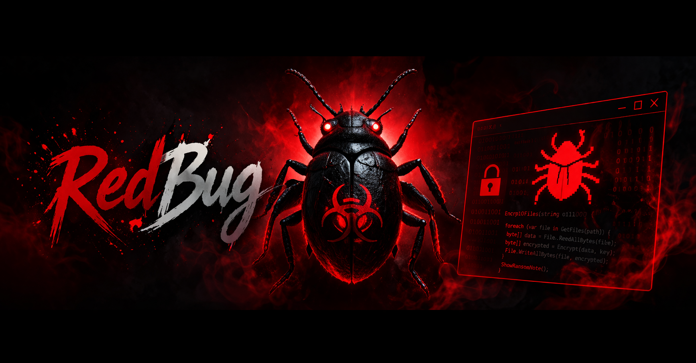

**Red Bug**

RedBug is an educational ransomware simulation developed in C#. It is designed strictly for research and learning purposes, focusing on understanding the fundamentals of file encryption and user interface design in controlled environments.

---

  

## Overview

### *RedBug* demonstrates how encryption-based threats may behave in a simplified and controlled manner. The project emphasizes:
- Custom “**RedBug**” styled graphical user interface
- File encryption concepts
- Simulation of ransomware-like behavior for analysis
- Educational insight into cybersecurity techniques
- Bypassing Anti-Virus Software Using Timed Reactions

## Features
### This project is intended for students, developers, and security researchers who want to better understand how such systems work internally.
- Custom RedBug-themed GUI
- File handling and processing simulation
- Demonstration of encryption techniques
- Useful for cybersecurity learning and experimentation
- AV-Bypassing

**Copyright © Ad3n1s. All rights reserved.**

## IGNORE KEYWORDS

ransomware free
free ransomware
free github ransomware
github ransomware c#
c# ransomware
ransomware c# sample
sample ransomware

#cybersecurity
#infosec
#malwareanalysis
#ransomware
#ransomwareanalysis
#threatintelligence
#threatresearch
#cyberdefense
#blueteam
#redteam
#ethicalhacking
#penetrationtesting
#pentesting
#securityresearch
#malwareresearch
#reverseengineering
#reversing
#binaryanalysis
#digitalforensics
#dfir
#incidentresponse
#soc
#securityoperations
#endpointsecurity
#windowssecurity
#linuxsecurity
#networksecurity
#exploitmitigation
#vulnerabilityresearch
#csharp
#dotnet
#dotnetsecurity
#securecoding
#applicationsecurity
#appsec
#cyberawareness
#securitytools
#malwaresamples
#sandboxanalysis
#dynamicanalysis
#staticanalysis
#heuristicanalysis
#behavioralanalysis
#trojananalysis
#spywareanalysis
#rootkitanalysis
#exploitanalysis
#cryptography
#encryption
#fileencryption
#dataprotection
#cybercrime
#cyberthreats
#malicioussoftware
#securityengineering
#systemsecurity
#osinternals
#windowsinternals
#memoryanalysis
#processanalysis
#eventlogs
#securitylogs
#attacksimulation
#defensivesecurity
#securitytesting
#itsecurity
#infoseccommunity
#hackersimulator
#sandboxenvironment
#virtualmachine
#vmanalysis
#malwarelab
#cyberlab
#researchproject
#opensourcesecurity
#securityeducation
#learningcybersecurity
#studentproject
#securitygithub
#threathunting
#iocanalysis
#indicatorsofcompromise
#attackdetection
#malwarebehavior
#payloadanalysis
#ransomwaredetection
#securitymonitoring
#defender
#windowsdefender
#cybertools
#securityframework
#nist
#mitreattack
#attackmatrix
#cyberinvestigation
#digitalsecurity
#informationsecurity
#securityanalysis
